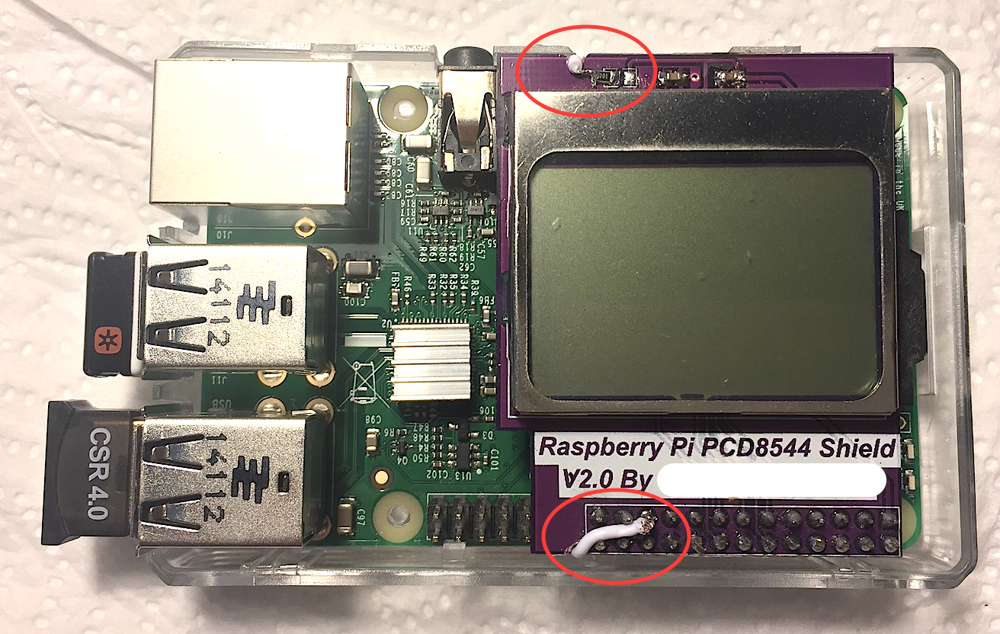
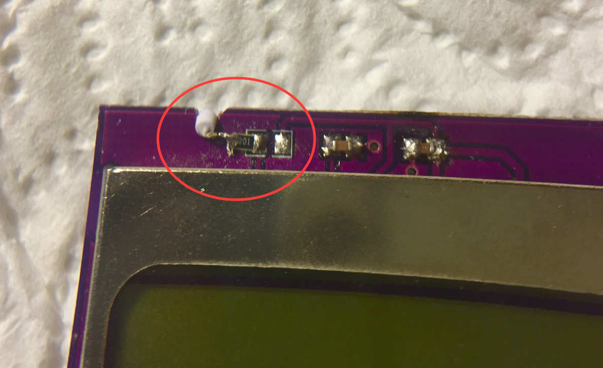
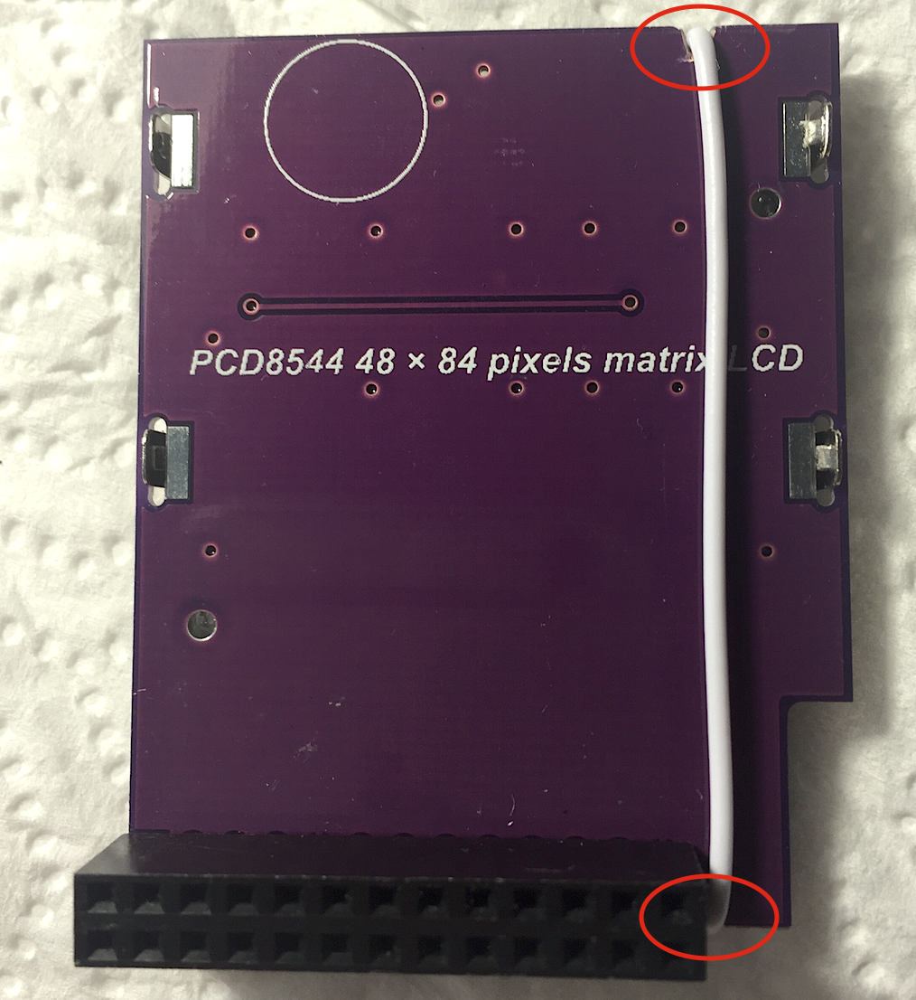

# PCD8544-utils
Utilities for PCD8544 LCD (Nokia3310/5110) shield for Raspberry Pi

This utilities are using WiringPi library and based on work
from Limor Fried, Adafruit Industries, Le Dang Dung and Andre Wussow.

The original pcd8544_rpi.c was modified with configurable physical PIN layout
through pin_setup.h file. Also added signal handling to clear the LED display
before exit when lcdstats process is interrupted.

Additional utilities are added to privide more functionality on LED backlight
control (see hardware modification description below) and message display.

Provided utilities can be used in shell scripting for Raspberry PI projects
requiring low cost message indication.

Download and install instructions are on http://wiringpi.com/download-and-install/

# Building

Clone repository and build

```
$ git clone git@github.com:acidum/PCD8544-utils.git
$ cd ./PCD8544-utils
$ make all
```

This will create binaries in ./bin directory.

You may want to edit src/pin_setup.h file to customize PIN numbers and LCD Contrast.


# Usage
Compiled programs require root priveleges to set Raspberry PI GPIO ports.

```
# Continuously print system statistics
$ sudo bin/lcdstats 

# Show Raspberry PI Logo
$ sudo bin/lcdlogo  

# Display text message
$ sudo bin/lcdprint 'Hello world!'

# Turn LED backlight ON, OFF and blinking
$ sudo bin/lcdlights on
$ sudo bin/lcdlights off
$ sudo bin/lcdlights blink
```

Owner for those files can be changed to root and SUID attributes applied to
be able to run without sudo.

# Hardware Hack to control Backlight LED
Multiple vendors do supply Raspberry Pi PCD8544 Shield having backlight
connected to +3.3V pin 1 through a resistor so that backlight is always ON if
Raspberry Pi is connected to power source. This might reduce the running time
if you have autonomous solution running on a battery.

## Disclaimer
Please note, that any modification you do is on your own risk, you also may
lose the a warranty for the modified components. Wrong assembly can also
destroy Raspberry Pi.

Steps to enable backlight control on a stock PCD8544 Rasberry Pi shield are
provided below.

## Parts list
* Raspberry Pi PCD8544 Shield
* Soldering iron
* Small piece of wire

## Steps
* Prepare PCB: create small groves on the edge of PCB to accommodate the wire.
this could be done using dremmerl tool or a smal rasp (see pictures below).
* Heat your soldering iron.
* With soldering iron melt both left and right joints of the resistor (see pictures below).
* When resistor is free, move it to the left so that it stays connected on one end.
* Solder a wire to the other side of resistor.
* Fit the wire into the groves
* Solder the wire to PIN21 (GPIO9)

## Pictures





